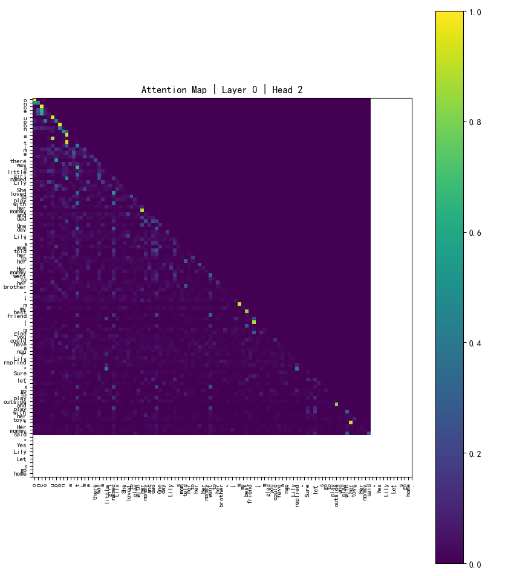
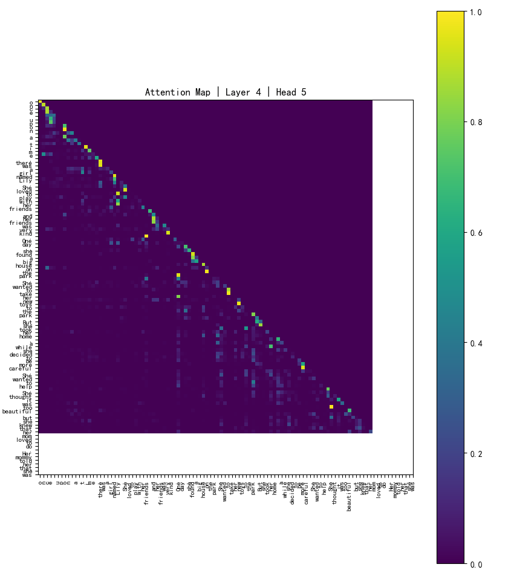
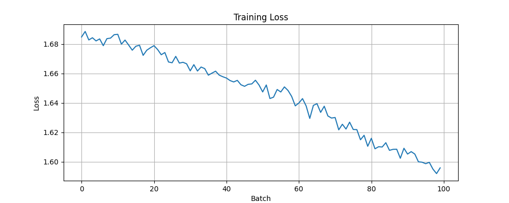
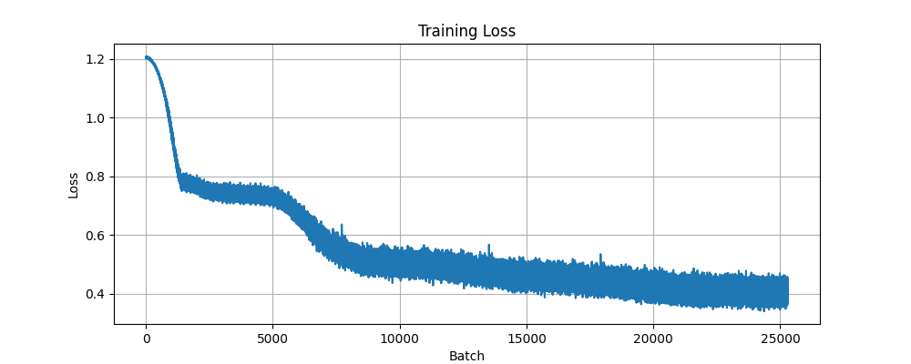
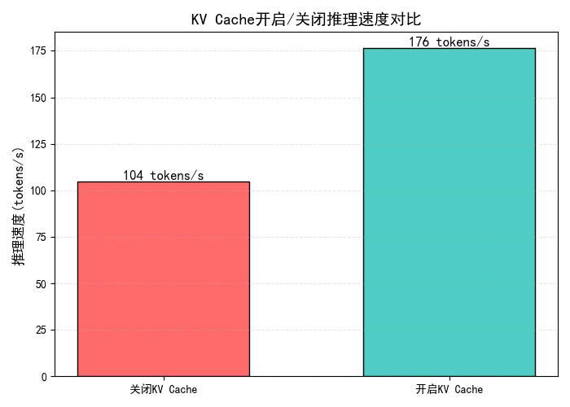

# Transformer From Scratch

从零实现 Transformer，包含***NumPy版（手写前向与反向传播）***和***PyTorch版（Decoder‑only+KV Cache）***。

目的：通过手写底层代码深入理解 LLM 的内部机制，并为后续扩展SAE、DPO等做准备。

---
## 已完成部分
1. **transformer手写框架（纯numpy/pytorch）**
2. **AdamW优化器+SGD优化器（支持权重衰减、学习率预热）**
3. **RoPE位置编码+正弦位置编码**
4. **断点续训**
5. **文本生成支持采样策略：温度采样、Top‑k、Top‑p**
6. **KV Cache的控制开关**
---
## 下一步计划

- [ ] TinyStories数据集训练与loss曲线分析
- [ ] 注意力热力图分析与稀疏性验证、量化
- [ ] KV Cache推理加速基准测试
- [ ] SwiGLU
- [ ] FoPE与RoPE长文本外推对比实验
- [ ] DPO（直接偏好优化）与SAE（稀疏自编码器）扩展
- [ ] MoE
- [ ] 完整的Encoder-Decoder翻译任务
---

## 实验结果

|           注意力热力图（Layer0 Head2）           |           注意力热力图（Layer4 Head5）           |
|:----------------------------------------:|:----------------------------------------:|
|  |  
|      注意力分布呈现稀疏模式，初步验证了模型对关键位置的聚焦能力       |           模型低层注意力头捕捉局部上下文关联，高层则建模全局序列依赖                        |

|                    局部损失曲线                     |                  全局损失曲线                   |
|:---------------------------------------------:|:-----------------------------------------:|
|  |  | 
|          训练中的局部损失下降趋势（TinyStories子集）          |         训练中的全局损失下降趋势（TinyStories）         |

|            KV Cache开启/关闭速度验证             |
|:----------------------------------------:|
|  | 
|      开启 KV Cache 后，模型推理速度从 104 tokens/s 提升至 176 tokens/s，实现了约1.7 倍的加速       |         

---
## 生成示例
> 输入 prompt: `Once upon a time`

> 模型输出: `once upon a time , there was a girl named Lily . She loved to play with her friends , and her friends was very kind . One day , she found a big house on the park . She wanted to take her new toys to the park . But she took her home , a while she decided to be more careful . She wanted to help . She thought it was too beautiful , but she knew that her mom loved to do . Her mommy told her that she was so happy . She said she could help her mom
`

>模型在未经过完整训练的情况下已能生成有一定连贯性的文本，展示了基本的语言建模能力。
## 😊 联系我
- QQ邮箱：515191716@qq.com
- Gmail：bai845014@gmail.com
- 小红书:https://www.xiaohongshu.com/user/profile/68871296000000001e008a71

我是一名大一学生，正在寻找NLP/LLM方向的远程助研机会，每周可投入 15-20 小时（学期中），寒暑假可全职。欢迎联系！

欢迎指正错误与指导！
